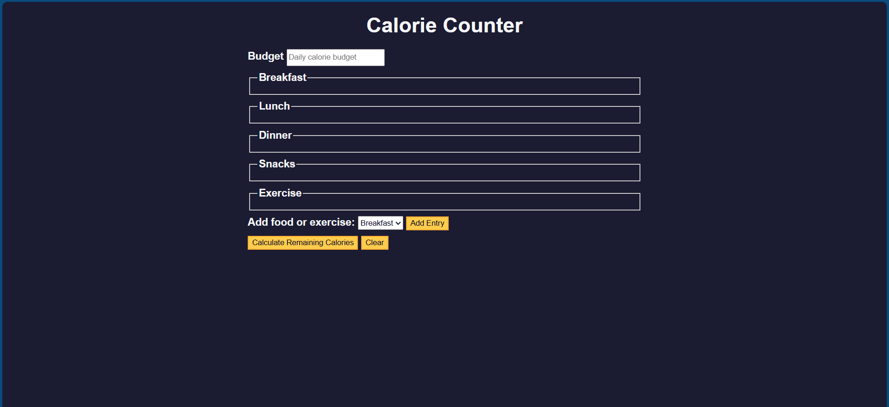

# freeCodeCamp-JavaScript

This repository is for any projects I work on from the free Code Camp - JavaScript Algorithms and Data Structures Certification. On these projects, I rarely work on the HTML and CSS files. More often than not, that is already given and I work on the JavaScript part of the project (since these projects are designed for JavaScript learning).

## Calorie Counter Project

In this project, I wired up a calorie-counter form by grabbing key DOM elements, then dynamically adding new inputs for the selected section (breakfast, lunch, dinner, snacks, or exercise) when “Add Entry” is clicked. On submit, calculateCalories prevents the page refresh, collects all number inputs, cleans them (removing +, -, and spaces), rejects invalid inputs, and totals each category. It computes calories consumed (meals + snacks), applies exercise as “calories returned,” compares everything to the budget, and reports a Deficit or Surplus with a styled message. clearForm wipes the extra inputs, resets the budget, and hides the output. Event listeners tie it all together so adding entries, calculating, and clearing feel seamless—even if you haven’t touched the code in a minute.
